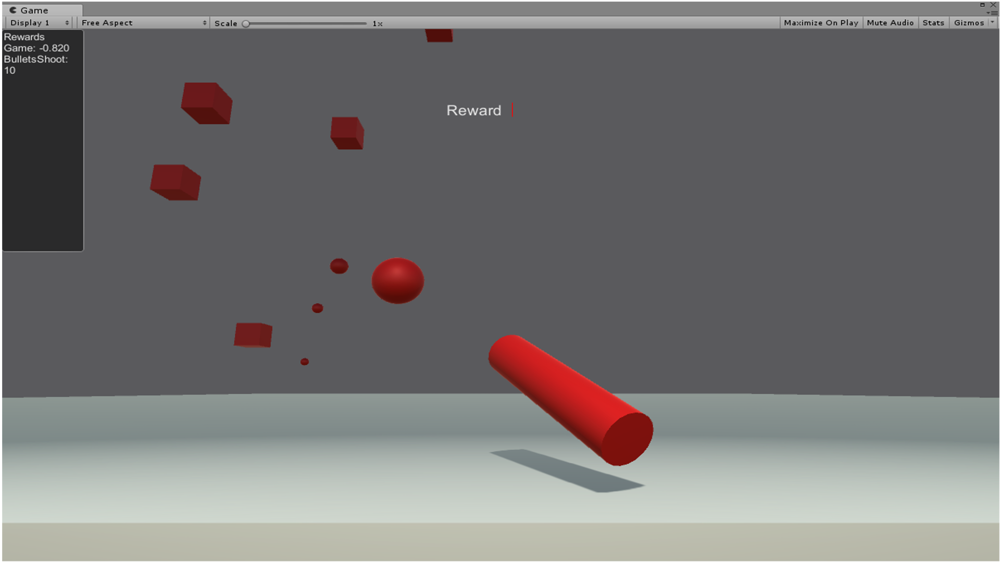
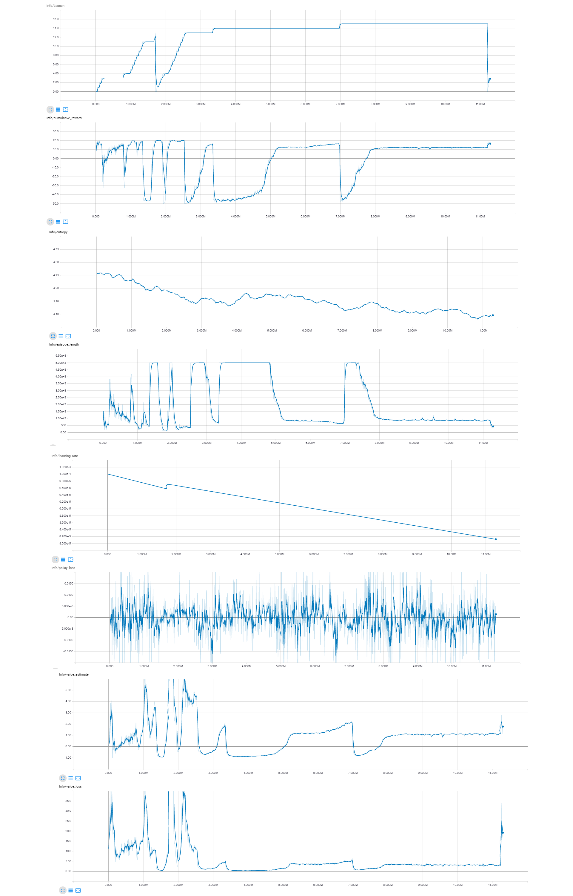

# Unity ML - Agents (Beta)

## Shooter game, created for the Unity ML-Agents Challenge

My objective was to train a ML-Agent to be able to hit targets that would be randomly spawned in the field.
I was not able to get the results that I was expecting. However, it was a very pleasant experience and made me really want to learn more about Machine Learning.

The Agent had 3 types of actions
1 - Rotate around the X axis
2 - Rotate around the Y axis
3 - Shoot

I tried a lot of different combinations of capturing the states of the game, but in the end I was using a total of 70 states that were normalized.
The states included the rotation of the weapon, if a shoot was given, information about the target and the bullets shoot.

I tried to play a lot with the hyperparameters and I also had to make a lot of experiencing with how I should do the reward. 

About the hyperparameters I am not knowledgeable in the area to make good predictions of what I could have done better, but in the rewards I think I was able to make some guesses.

My initial idea was to make a penalty for each ball missed and reward each target destroyed. However, I think that maybe because of the difference in time between the action of shooting and the bullet hitting a target or missing was too long, so the Agent was not being able to correlate the action with the reward/penalty and it was taking too long to learn something.

So I decided to make the penalty in the moment the shoot was given and give a better reward for hitting a target. But that led the Agent to think that was better to don't shoot as in the beggining he will miss most of his shoots.

As I wanted him to at least start hitting the targets I decided to remove the penalty for shooting, giving a very small penalty each step and ending the episode when he reached 20 points.
That was the scenario that I used in the training bellow:

I used the Curriculum Learning to achieve these results, I started using a fixed position for the targets and after that introduce the movement to the targets, but my Agents were not able to get to the lessons where the targets starts to move.

This is the final result https://www.youtube.com/embed/GS_8soT_YhQ
